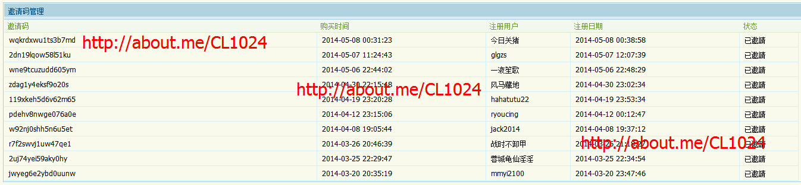

手把手教你免费获得caoliu社区邀请码
===================================  

1024caoliu节和猎豹浏览器，以及近来的央视新闻让“caoliu社区”走近了大众的视界。从那以后，我也走进了寻找caoliu社区邀请码的道路。
一直以来，我发现caoliu邀请码真的是很难获得？这是为何呢？
通过我的理解，原因有以下几点：
		1、caoliu社区邀请码的需要300贡献值或许3000USD才能获取。关于高等级人物来说，这是小菜一碟，但是关于百分之九十以上的caoliu用户来说，这简直便是梦。说白了，caoliu社区邀请码掌握在少数的高等级用户手中。
		2、caoliu社区实施连坐原则，高等级玩家的账号也是常年积累的而来的。可不想随意把邀请码发给任意一个人，因为自个的一时忽略可以带来的便是一同禁言。这简直便是杯具。而这样的事类在1024吧里常常看到。
		3、caoliu社区的游客太多。人多粥少，以致于淘宝上的caoliu聘请码也求过于供。
归纳以上几点，你大约知道自个如何去寻找caoliu邀请码了。
请与你们的好友一起分享 （caoliu最新地址 [http://about.me/CL1024](http://about.me/CL1024)）每天更新的caoliu社区最新地址。
每天不定时发CL邀请码: [https://groups.yahoo.com/groups/new-1024-caoliu/](https://groups.yahoo.com/groups/new-1024-caoliu/)
后备地址: [https://github.com/caoliu1024/caoliu](https://github.com/caoliu1024/caoliu)

免费获得caoliu社区邀请码的方法
------

操作过程：复制本文全部内容（包含链接和图片），发布到10个博客或论坛，发布后将帖子地址，发到邮箱caoliushequ@outlook.com进行审核
验证网页7天内能正常访问，通过后即附送邀请码回复到你的邮箱!
假如遇到内容违规，不能发布，能够把“caoliu”改成“草镏”、“草柳”“caoliu”之类的词替代。

附博客列表(不限这些): 
> blogbus.com
> 
> china.alibaba.com
> 
> xihalife.com
> 
> tuita.com
> 
> ixiezi.com
> 
> en.netlog.com
> 
> space.itpub.net
> 
> flickr.com
> 
> blog.twioo.com
> 
> blog.cd blogoak.com
> 
> weebly.com
> 
> blogi.eastday.com
> 
> blogi.eastday.com
> 
> 天涯博客
> 
> yahoo博客
> 
> 新浪博客
> 
> 搜狐博客
> 
> 网易博客

### 最新获得caoliu邀请码名单：
 

转载请注明：[http://about.me/CL1024](http://about.me/CL1024)
